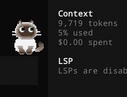

# Meowdoro



A small companion cat that lives on your desktop while you work — pomodoro timer, reminders, AI-agent awareness, and a tiny pattern editor so you can paint the cat the way you like.

> **Note:** This is a prototype build. The license flow uses a local prototype endpoint with hardcoded keys (see [Prototype license keys](#prototype-license-keys) below) and is not connected to a real payment backend.

## Features

- **Desktop pet** that follows your cursor, reacts to typing (typing heat, purr, head shake), and stretches on a schedule.
- **Pomodoro** with focus / break timers and a quick context-menu picker.
- **Reminders** that trigger pings or speech bubbles, with one-off / weekday / weekend / custom repeat rules.
- **AI-agent awareness** — hook scripts for **Claude Code**, **Antigravity (Gemini)**, and **Cursor** so the pet notices when an agent is thinking, working, idle, or waiting for approval.
- **Pattern editor** for painting the cat's spots, base color, eye color (incl. odd-eye), and saving / exporting presets.
- **Share video** capture (mp4) of a screen crop with the pet in frame.
- **Multi-language** UI: English, 한국어, 日本語.

## Stack

- [Electron](https://www.electronjs.org/) (main + renderer + separate editor + license windows)
- `uiohook-napi` for global keyboard / wheel hooks
- `ffmpeg-static` for the share video mp4 conversion
- `electron-builder` for packaged builds (configured in `package.json`)

## Quick start

```bash
git clone https://github.com/jandev-png/Meowdoro.git Meowdoro
cd Meowdoro
npm install
npm start
```

On first launch the app will show the license window. Enter one of the [prototype keys](#prototype-license-keys) below.

### Other scripts

| Script | What it does |
| --- | --- |
| `npm start` | Run the app in dev mode. |
| `npm run smoke` | Boot the app, log a startup line, and quit. Useful for CI smoke tests. |
| `npm run pack` | Build an unpacked Electron app into `dist/`. |
| `npm run dist` | Build installable artifacts for the current OS (`.dmg` / `nsis` / `AppImage`). |
| `npm run dist:win` | Windows-only `.exe` installer (NSIS). |
| `npm run dist:mac` | macOS-only `.dmg`. |
| `npm run dist:linux` | Linux-only `AppImage`. |

## Prototype license keys

This build ships with a prototype license endpoint (`prototype-license/endpoint.js`) that accepts any of the following keys. Paste one into the license window on first launch:

```
CATJANG-PROTO-ALPH-0001-AAAA-BBBB-CCCC
CATJANG-PROTO-BETA-0002-DDDD-EEEE-FFFF
CATJANG-PROTO-GAMM-0003-GGGG-HHHH-IIII
CATJANG-PROTO-DEMO-1234-5678-9ABC-DEF0
```

The validation logic is intentionally tiny — see `prototype-license/endpoint.js` if you want to add or change keys.

> To replace this with a real backend, swap `prototype-license/endpoint.js` for an `https` call to your service and keep the same `{ ok, license }` / `{ ok: false, reason }` return shape.

## Project layout

```
main.js                       # Electron main process (windows, IPC, agent monitors, hook install)
preload.js                    # contextBridge surface exposed to renderer / editor / license
prototype-license/
  endpoint.js                 # prototype license validation (see above)
renderer/                     # pet window (HTML / CSS / JS + auto-generated cell-mappings.js)
editor/                       # pattern editor window
license/                      # license activation window
hooks/
  install.js                  # registers / updates / removes Claude / Antigravity / Cursor hooks
  Meowdoro-claude-hook.js
  Meowdoro-antigravity-hook.js
  Meowdoro-cursor-hook.js
  server-config.js            # shared HTTP post helper for the hooks
agents/                       # log-file watchers for Codex / Kiro / Cursor agent activity
presets/patterns/             # built-in pattern JSON presets
svg/                          # SVG animations for the pet (idle, press, scroll, jump, stretch, ...)
workspace/
  assets/img/presets/         # preset thumbnails
  assets/sound/               # meow / alert / purring audio
  assets/svg/                 # SVG body parts + logo
assets/                       # Meowdoro-logo.{png,ico} for the OS window icon
```

## AI-agent hook integration

On first run the main process copies the three hook scripts into your user-data `hooks/` directory and registers them with each editor's settings file:

| Agent | Settings file | Events |
| --- | --- | --- |
| Claude Code | `~/.claude/settings.json` | `SessionStart`, `SessionEnd`, `UserPromptSubmit`, `PreToolUse`, `PermissionRequest`, `PostToolUse`, `PostToolUseFailure`, `Stop`, `StopFailure`, `Notification`, `Elicitation` |
| Antigravity (Gemini) | `~/.gemini/config/hooks.json` | `PreInvocation`, `PostToolUse`, `PostInvocation`, `Stop` |
| Cursor | `~/.cursor/hooks.json` | `beforeShellExecution`, `beforeMCPExecution` |

In addition, the in-app log monitors tail these locations to track agent state when no hook is wired up:

- Codex: `~/.codex/sessions/YYYY/MM/DD/rollout-*.jsonl`
- Kiro: `~/Library/Application Support/Kiro/logs/`
- Cursor: `~/Library/Application Support/Cursor/logs/`

Hook scripts POST events to the local agent-state server bound to `127.0.0.1:23456`.

## Permissions & platform notes

- **macOS** — first time the pet reacts to global typing, you will be prompted for **Accessibility** (and sometimes **Input Monitoring**). Both can be granted in `System Settings → Privacy & Security`.
- **Windows** — security software can block the global hook; if typing reactions never start, look for a prompt from your AV product.
- **Linux** — works as a normal Electron app, but global keyboard hooks may require additional udev rules depending on the distro.

## License

CC BY-NC 4.0 — free to use and modify, no commercial use, credit **jan (nerfspeed on Discord)**. See [`License.md`](./License.md).
